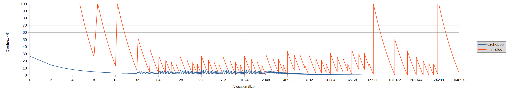
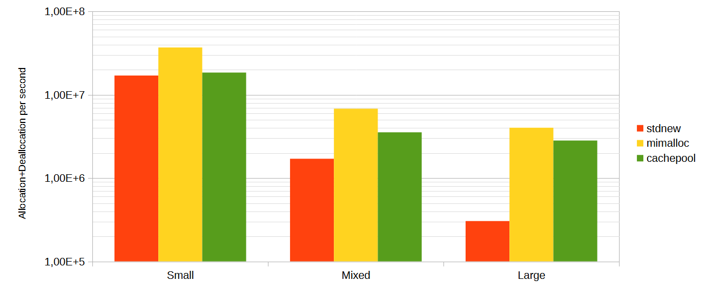

## Cache pool

A small library implementing 2 types of memory pools with fixed capacity.
- A fixed size pool, where all blocks have the same size. 
- A variable size pool, which can allocate any size.

Unlike other pools these do not dynamically resize; once they are full you will get an std::bad_alloc or fallback to using new[]. They might prove useful for caching systems with a target memory usage because:
- They have very low memory overhead compared to more general allocators.
- As the memory is preallocated the OS does not have to continually allocate individual pages, lowering processing overhead.

## FixedCachePool

Very simple memory pool with fixed size blocks. allocate() and free() are O(1). Memory overhead is 2 bits per block.

For a memory pool with fixed size blocks you only need a stack. The stack is essentially a list of indexes of free blocks. 
- On allocation you pop the top index from it, and use it as your pointer. 
- On deallocation, you insert the index at the top.
 
To reduce memory use, I group blocks into chunks. Each chunk has a bitmap which shows which blocks in it are free. We can quickly find a free block in that bitmap using a bit scan. In this case the stack contains indexes of chunks that are not full. 
- On allocation we take the top chunk from the stack, and remove it ONLY if it becomes full.
- On deallocation we push the chunk into the stack ONLY if it was previously full.

## VariableCachePool

A memory pool which can allocate and deallocate any number of bytes. allocate() and free() are O(log n), with n the number of allocated segments in the pool.

The pool is composed of blocks of 64 bytes. It has 2 different allocation mechanisms depending on the size:
- **>=2048 bytes**: uses a binary tree to quickly find a free segment with enough capacity for the given allocation. A segment can be composed of any number of blocks. Each block has associated information, such as whether is free or occupied, the length of the segment it belongs to and an index pointing to the previous segment.
- **<2048 bytes**: takes several contiguous blocks using the previous algorithm, and initializes a FixedCachePool in them with an appropiate block size. It uses a linked list to keep track of pools with available blocks for each size. 

The overhead varies depending on the size of the allocation.

> mimalloc has really high overhead spikes at sizes 64KiB and 512KiB. I am not sure if this is really how it works or if its a configuration issue on my side.

It has decent allocation throughput in single threaded environments. The following tests were done using:
- Visual Studio 2026
- Windows 11
- Ryzen 6900HX@3.3GHz.

The following commands were used:
- Small allocations: `cachepool -s 42 -d 1e-2 -a 1000000 -p 1000000000 benchmark mimalloc`
- Mixed allocations: `cachepool -s 42 -d 1e-5 -a 1000000 -p 1000000000 benchmark mimalloc`
- Large allocations: `cachepool -s 42 -d 0 -a 1000000 -p 1000000000 benchmark mimalloc`

## Libraries used

B-tree from [parallel-hashmap](https://github.com/greg7mdp/parallel-hashmap) by Gregory Popovitch.